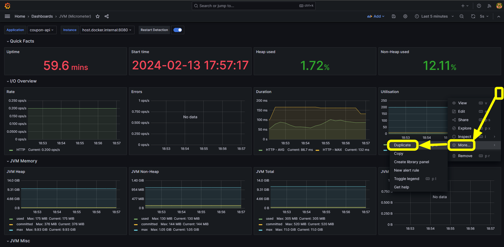
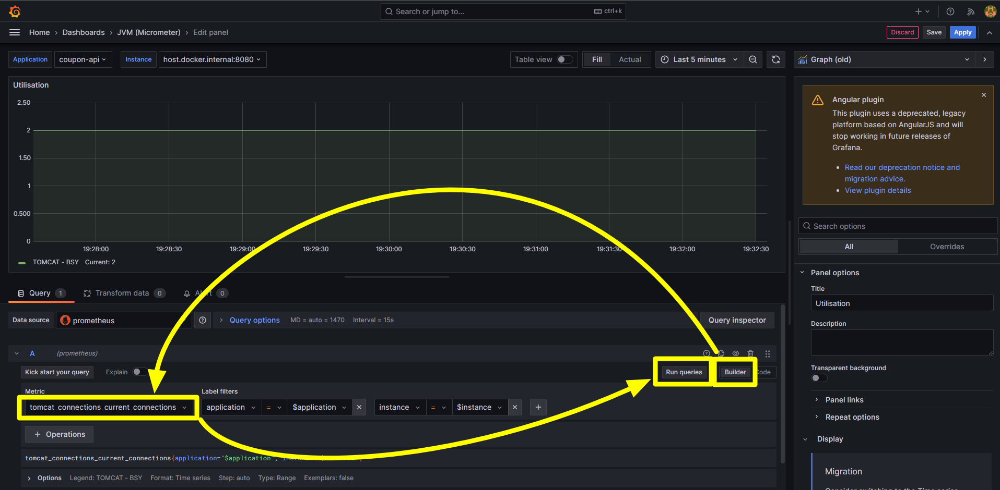
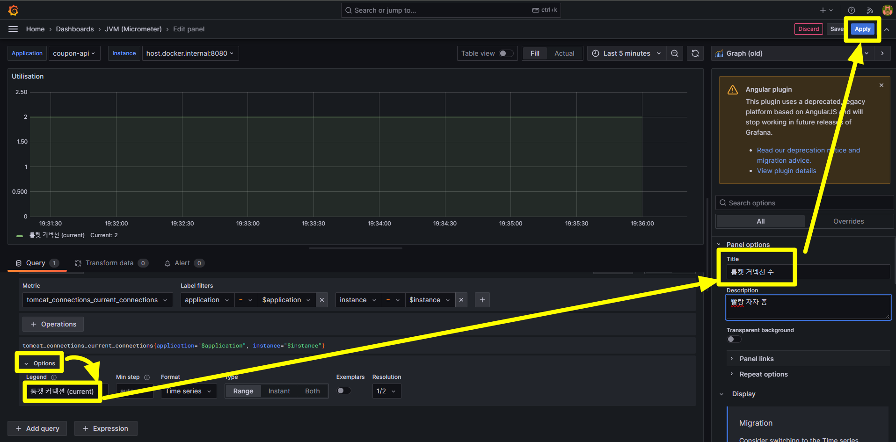
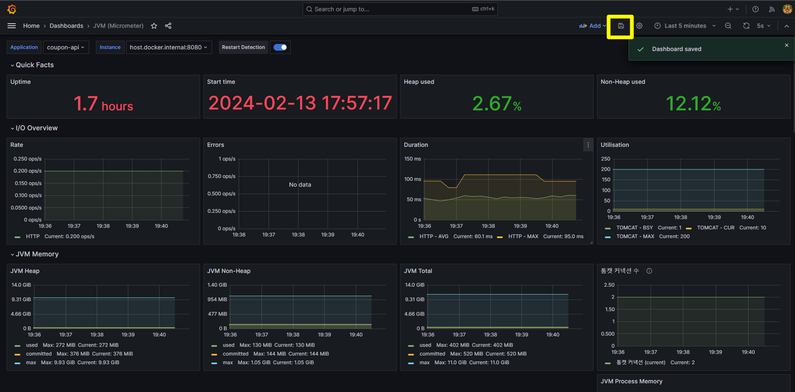

## Grafana Dashboard 세팅
Tomcat 커넥션이 얼마나 증가하는지를 보기 위한 지표 차트를 세팅합니다. 

`Utilisation` 내의 점 세개 버튼 클릭 → `More ...` → `Duplicate` 클릭

 

이동한 페이지에서는 오른쪽의 `Builder` 버튼 클릭 후 `Metric` 중에서 `tomcat_connections_current_connections` 를 선택합니다. 그리고 `Run queries` 를 클릭합니다. 

`Options` 버튼 클릭 후 `Legend` 항목에는 `톰캣 커넥션 (current)` 를 입력해줍니다. 이어서 오른쪽에서 `Panel Options` 의 Title 도 아래와 같이 알아볼 수 있는 제목을 지어줍니다. 
모두 완료되었으면 우측 상단의 `Apply` 버튼을 클릭합니다. 

 

대시보드 페이지에서는 변경된 사항을 저장하기 위해 디스켓 모양의 버튼을 클릭해서 현재 대시보드의 상태를 저장합니다.

 

