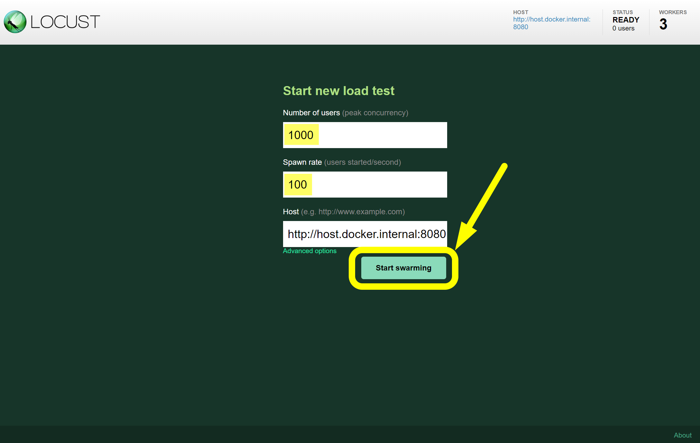

## Locust 세팅

Locust 에서는 아래와 같이 세팅을 해줍니다. 1100 명의 User 인입을 테스트하는 것이고 1초에 100 명의 유저를 생성해냅니다. Host 는 [http://host.docke.internal:8080](http://host.docke.internal:8080) 로 지정했습니다.

 

모두 선택했다면 Start Swarming 을 눌러서 실행합니다. 
