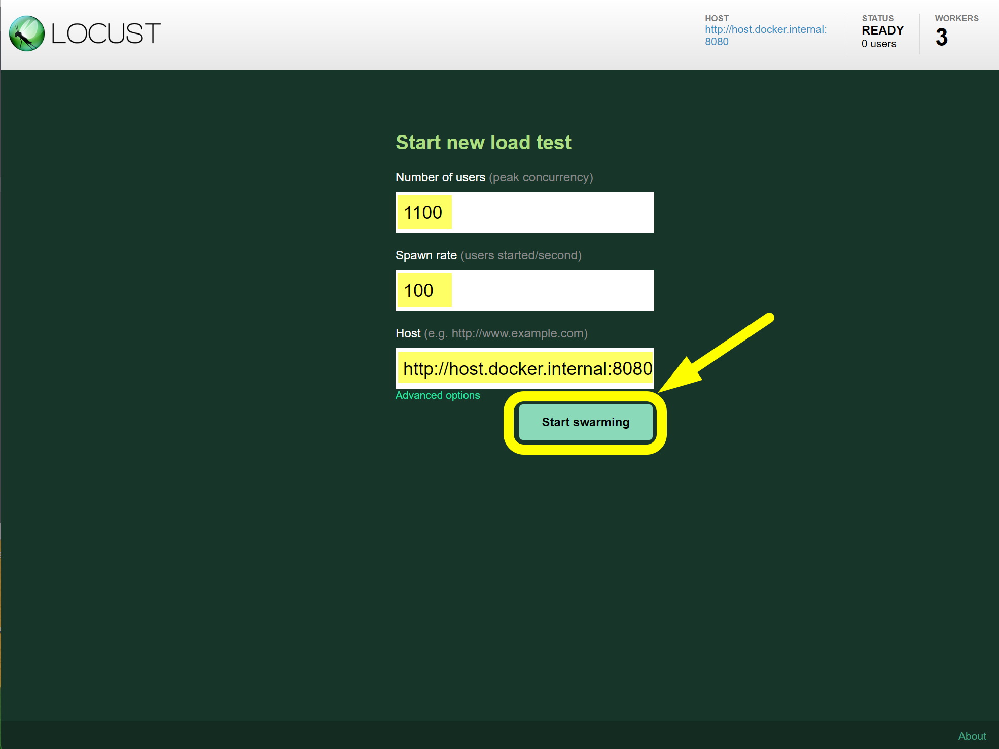

## 테스팅 기록 

### Coupon 데이터 생성
쿠폰의 발급 가능한 총 개수를 1000 으로 설정했습니다. 1100 명의 사용자가 요청을 하더라도 1000명 까지만 발급이 가능합니다.
```sql filename="schema.sql" {0} copy
INSERT INTO coupon.coupons(
    title, coupon_assign_type, total_quantity, issued_quantity, discount_amount,
    min_available_amount, issue_start_datetime, issue_end_datetime, created_datetime, updated_datetime
)
VALUES (
           '50% 세일. 과연 누가 주인공이 될 것인가?', 'FIFO', 1000, 0, 50,
           1000, '2024-01-01 00:00:01', '2024-11-11 23:59:59', '2023-12-31 23:00:00', '2023-12-31 23:00:00'
       );

COMMIT;
```
<br/>

### Locust
먼저 Locust 에서 아래의 세팅을 통해서 아래의 테스트 조건을 걸어주고 테스트를 시작합니다.

<br/>

### 데이터 저장 확인
`coupon_issues` 테이블에는 아래와 같이 1000개의 coupon 이 정상적으로 저장되어 있음을 확인 가능합니다.<br/>

<br/>

`coupons` 테이블에는 아래와 같이 정상적으로 `issued_quantity` 가 1000 으로 정상적으로 세팅된 것을 확인 가능합니다.<br/>

<br/>

### 레디스 확인
#### 데이터 요청 대기열 확인
요청 대기열은 아래와 같이 테스트 초기에는 936 개의 요청을 저장하고 있습니다.

<br/>

잠시 동안의 순간에 Refresh 버튼을 눌러서 새로 변경된 내용을 조회해보면 아래와 같이 473 개의 요청으로 줄어들어 있습니다.<br/>
정상적으로 작업 대기열이 비워지고 있습니다.<br/>

<br/>

#### 데이터 요청 기록 SET 확인
SortedSet 을 사용할수도 있겠지만, Set과 List 를 조합한 FIFO 구조로 작업 대기열을 구성했는데, List 를 통해 FIFO 를 구현했고, 요청 각각은 Set 을 통해 요청 고유값을 식별합니다. 따라서 Set 의 Size 가 1000 개라면 정상적으로 요청을 모두 받아두었다는 것을 확인 가능합니다.

<br/>

#### Grafana 확인
`coupon-api` 의 상태를 그라파나를 통해 확인해봅니다. locust 를 통해 `coupon-api` 로 유입되어서 톰캣 커넥션 수가 증가하고, 레디스에 접근하는 IO 작업 역시 증가함을 확인 가능합니다.

<br/>

`coupon-issuer` 의 상태입니다.

<br/>
