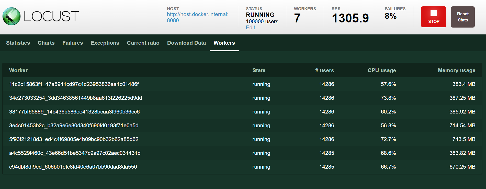

## locust 세팅하기
locust 는 성능부하를 테스트하기 위한 테스트입니다. docker-compose 등을 통해 스케일링이 가능하고, 기본으로 제공하는 dashboard 도 강력하기에 성능부하를 실험하고, 측정하기에 용이한 도구입니다.<br/>
<br/>

## 참고
- [locust.io](https://locust.io/)
- [docs.locust.io/en/stable](https://docs.locust.io/en/stable/)
<br/>

## API 정의
테스트할 API 를 정의합니다.
```java filename="CouponApiController.java" {3} copy
@RequiredArgsConstructor
@RestController
public class CouponApiController {

    private final CouponApplicationService couponApplicationService;

    @PostMapping("/coupon/issue")
    public CouponIssueResponse issue(@RequestBody CouponIssueRequest request){
        couponApplicationService.issueAsync(request);
        return new CouponIssueResponse(SUCCESS, SUCCESS.getMessageKr());
    }

}
```
<br/>

위의 코드에서 CouponApplicationService 클래스 내의 issueAsync(request) 메서드는 아무 동작도 하지 않는 비어있는 메서드입니다.<br/>
<br/>

## docker-compose
docker-compose 파일을 아래와 같이 작성해줍니다.
```dockerfile filename="docker-compose.yml" {3} copy
version: '3.7'
services:
  master:
    image: locustio/locust
    ports:
      - "8089:8089"
    volumes:
      - ./:/mnt/locust
    command: -f /mnt/locust/locustfile-coupon-request.py --master -H http://host.docker.internal:8080

  worker:
    image: locustio/locust
    volumes:
      - ./:/mnt/locust
    command: -f /mnt/locust/locustfile-coupon-request.py --worker --master-host master
```
<br/>

## python 파일 정의
```python filename="locustfile-coupon-request.py" {3} copy
import random
from locust import task, FastHttpUser, stats

stats.PERCENTILES_TO_CHART = [0.95, 0.99]


class CouponRequest(FastHttpUser):
    connection_timeout = 10.0
    network_timeout = 10.0

    @task
    def issue(self):
        payload = {
            "userId": random.randint(1, 10000000),
            "couponId": 1
        }
        with self.rest("POST", "/coupon/issue", json=payload):
            pass

```
<br/>

## 실행
아래의 명령어를 통해 실행합니다.
```bash filename="run-docker-compose.sh" {3} copy
docker-compose up -d --scale worker=3
```
<br/>

## Docker Desktop 확인
아래와 같이 worker 3기, master 1의 구성으로 docker 애플리케이션이 구동된 모습을 확인 가능합니다.

<br/>

## locust 애플리케이션 접속

<br/>

## load 설정

<br/>

`Number of users`
- 몇명의 사용자까지 만들어낼 것인지 
- 위의 사진에서는 10만명까지의 유입을 만들어내겠다는 의미
<br/>

`Spawn rate`
- 1초에 몇명의 사용자를 생성해낼 것인지
- 위의 사진에서는 1초에 1000명씩 유저를 생성되어서 유입되게끔 했습니다.
- 1초: 1000명, 2초: 2000명, 3초: 3000명, ... 100초 : 100000명
<br/>

`Host`
- 요청을 보낼 주소
<br/>

## load 테스트
로드를 `spawning` 하고 있는 모습

<br/>


차트 탭

<br/>

Failures 탭
요청이 실패한 것의 기록이다.

<br/>


이번에는 Workers 탭으로 이동한다. 자세히 보면 CPU 사용률이 100% 이상으로 올라가고 있다.

<br/>


worker 들의 로드를 줄여주기 위해 이번에는 worker 수를 7개로 늘려봅니다.
```bash filename="bash" {3} copy
$ docker-compose scale worker=7
```
<br/>

각 worker 의 cpu 사용량은 줄어들었습니다.

<br/>