## prometheus, grafana 세팅

Prometheus 를 통해 애플리케이션이 모니터링 가능하도록 하고, Grafana 로 모니터링하는 과정을 설명합니다.<br/>
이론적인 내용이나 개념도 설명할까 했는데, 피곤해서 거기까지는 설명을 못하고 어떻게 하는지만 설명을 남겨두기로 했습니다.<br/>
<br/>

## coupon-api 
### build.gradle.kts
`spring-boot-starter-actuator`, `micrometer-registry-prometheus` 를 의존성으로 추가해줍니다. 
```kotlin
// ...

dependencies {
    // ...

    // prometheus
	implementation("org.springframework.boot:spring-boot-starter-actuator")
	implementation("io.micrometer:micrometer-registry-prometheus")

    // ...
}
```
<br/>

### application-api.yml
application-api.yml 파일에 `spring.application.name`, `server.tomcat.mbeanregistry.enabled`, `management.metrics.tags.application`, `management.endpoints.web.exposure.include = prometheus`를 추가해줍니다.
```yaml
spring:
  application:
    name: coupon-api

# ...
# ...

server:
  port: 8080
  tomcat:
    mbeanregistry:
      enabled: true
management:
  metrics:
    tags:
      application:
        ${spring.application.name}
  endpoints:
    web:
      exposure:
        include: prometheus
```
<br/>

## coupon-issuer
이번에는 `coupon-issuer` 측의 설정입니다.<br/>
### build.gradle.kts
`spring-boot-starter-actuator`, `micrometer-registry-prometheus` 를 의존성으로 추가해줍니다. 
```kotlin
// ...

dependencies {
    // ...

    // prometheus
	implementation("org.springframework.boot:spring-boot-starter-actuator")
	implementation("io.micrometer:micrometer-registry-prometheus")

    // ...
}
```
<br/>

### application-issuer.yml
application-issuer.yml 파일에 `spring.application.name`, `server.tomcat.mbeanregistry.enabled`, `management.metrics.tags.application`, `management.endpoints.web.exposure.include = prometheus`를 추가해줍니다.
```yaml
spring:
  application:
    name: coupon-issuer

# ...
# ...

server:
  port: 8081 # 8081 포트를 사용합니다. 주의해주세요.
  tomcat:
    mbeanregistry:
      enabled: true
management:
  metrics:
    tags:
      application:
        ${spring.application.name}
  endpoints:
    web:
      exposure:
        include: prometheus
```
<br/>

## coupon-api, coupon-issuer 모듈 구동
`coupon-api`, `coupon-issuer` 모듈을 각각 스프링부트 애플리케이션으로 구동합니다. 각각 `8080`, `8081` 포트에 구동됩니다.<br/>
<br/>

## prometheus 메트릭 조회 가능 여부 확인
간단하게 `coupon-api` 측에서의 접근이 가능한지를 확인해봅니다.<br/>
[http://host.docker.internal:8080/actuator/prometheus](http://host.docker.internal:8080/actuator/prometheus) 으로 접속해주세요. 만약 docker 에서 prometheus 를 띄우지 않고 로컬호스트에서 prometheus 를 구동했다면 [http://localhost:8080/actuator/prometheus](http://localhost:8080/actuator/prometheus)으로 접속하시면 됩니다.<br/>
<br/>

아래와 같이 메트릭 조회가 성공적으로 되어야 합니다. 비정상일 경우 `White Label Error Page` 오류가 나타납니다.
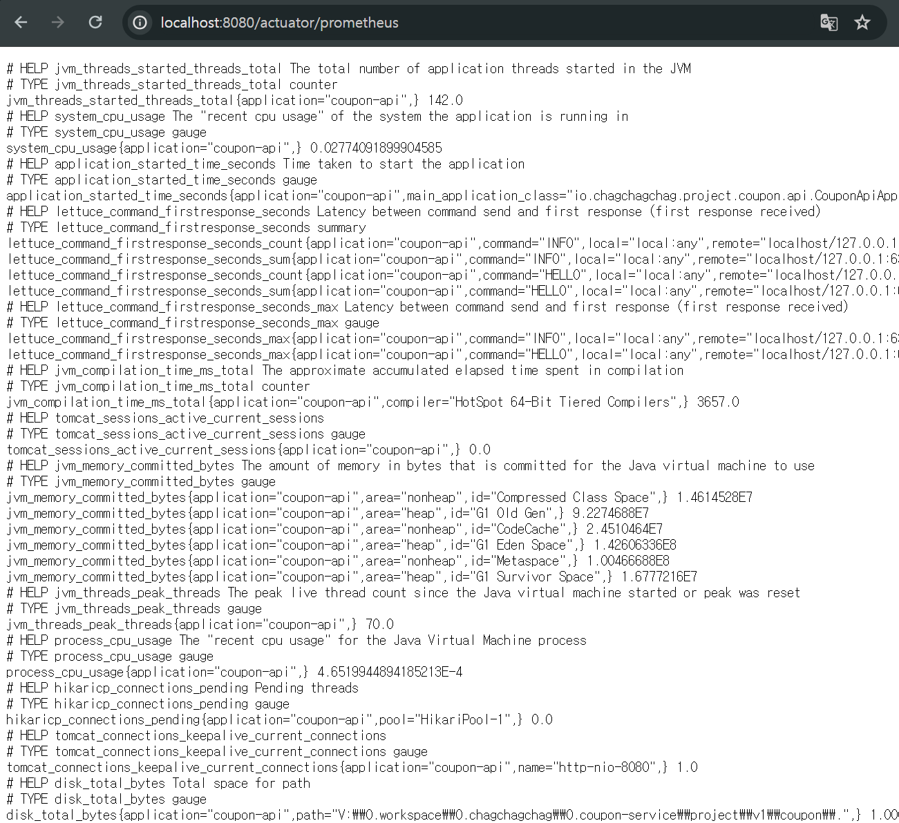
<br/>

`coupon-issuer` 에 대해서도 같은 방식으로 동작을 확인해보시기 바랍니다.<br/>
<br/>

## Docker-Compose Prometheus, Grafana 세팅
### monitoring/prometheus/config/config.yml
`0.performance-test/monitoring/prometheus/config/config.yml` 을 아래와 같이 작성합니다.
```yaml
global:
  scrape_interval: 5s

scrape_configs:
  - job_name: "coupon-api"
    metrics_path: '/actuator/prometheus'
    static_configs:
      - targets: [ 'host.docker.internal:8080' ]
  - job_name: "coupon-issuer"
    metrics_path: '/actuator/prometheus'
    static_configs:
      - targets: [ 'host.docker.internal:8081' ]
```
<br/>

### docker-compose.yml
`0.performance-test/monitoring/docker-compose.yml` 을 아래와 같이 작성합니다.
```yaml
version: '3.7'
services:
  prometheus:
    image: prom/prometheus
    container_name: prometheus
    volumes:
      - ./prometheus/config:/etc/prometheus
      - ./prometheus/volume:/prometheus
    ports:
      - 9090:9090
    command:
      - '--config.file=/etc/prometheus/config.yml'
    restart: always
    networks:
      - prometheus_network
  grafana:
    image: grafana/grafana
    container_name: grafana
    ports:
      - 3000:3000
    volumes:
      - ./grafana/volume:/var/lib/grafana
    restart: always
    networks:
      - prometheus_network
networks:
  prometheus_network:
    driver: bridge
```
<br/>

작성이 완료되었으면 터미널에서 `0.performance-test/monitoring/` 으로 이동 후에 아래의 명령어를 수행합니다.
```bash filename="bash" {3} copy
docker-compose up -d
```
<br/>

## Grafana 세팅
이번에는 Grafana 에서 Prometheus 를 설정하는 방식을 알아봅니다.

### Grafana 접속 & 패스워드 변경
Grafana 에 접속합니다. 접속 주소는 [http://localhost:3000](http://localhost:3000) 입니다.<br/>
id = admin, password = admin 을 입력하고 접속합니다.
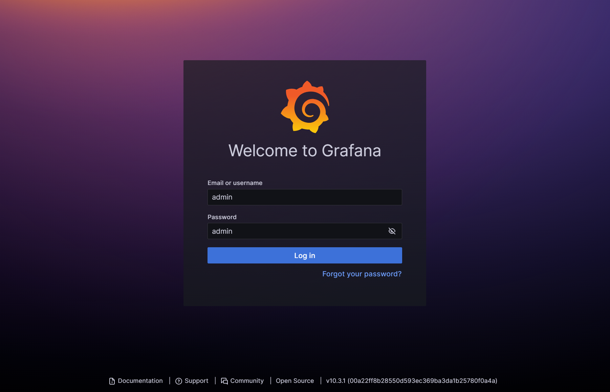
<br/>

비밀번호를 변경하는 페이지입니다. 비밀번호를 변경하기 귀찮다면 `Skip` 버튼을 클릭하고, 변경할 것이라면 `New password`, `Confirm new password` 를 모두 입력하고 `Submit` 버튼을 눌러서 비밀번호 변경을 완료합니다.
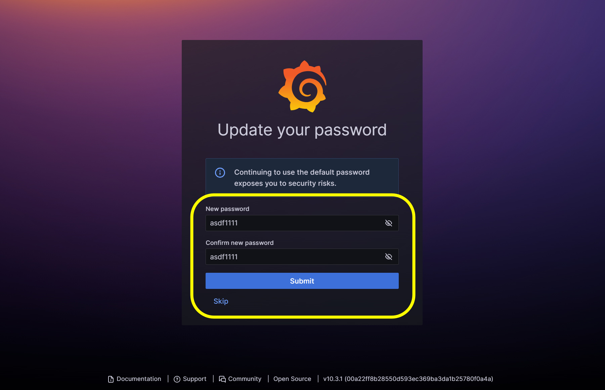
<br/>

### Dashboard 생성, Prometheus 세팅
새로 나타난 페이지에서는 `Dashboard > Create your first dashboard` 를 클릭해서 대시보드 설정 페이지로 이동합니다.<br/>
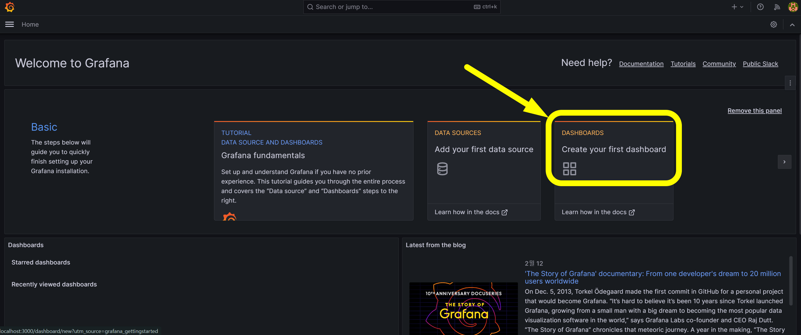
<br/>

`Import a dashboard` 를 클릭합니다.
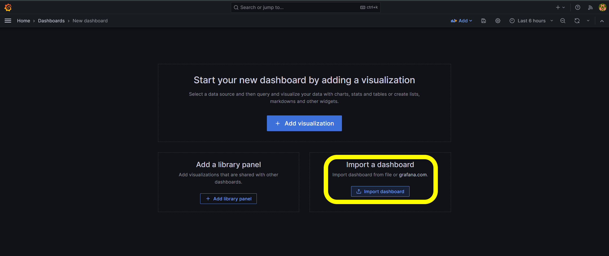
<br/>

새로 나타난 페이지에서 `4701` 을 입력하고 `Load` 버튼을 클릭합니다.
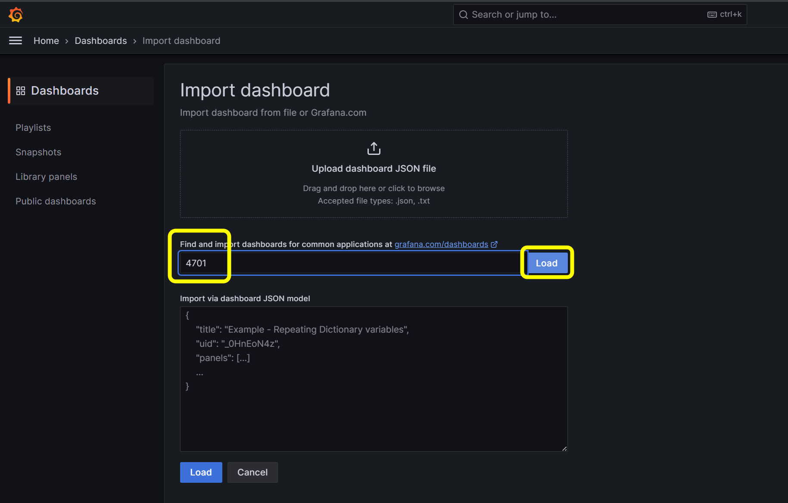
<br/>

`Configure a new datasource` 버튼을 클릭합니다.
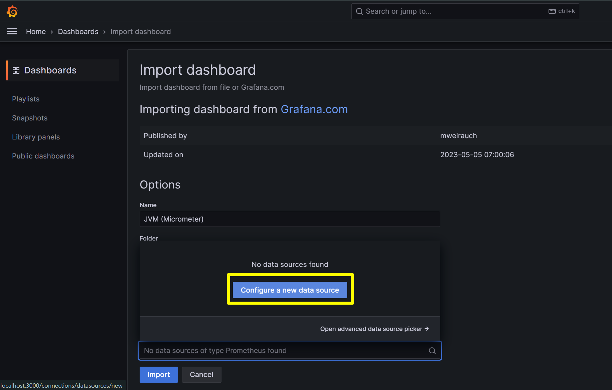
<br/>

나타난 datasource 선택 화면에서 `Prometheus` 를 선택합니다.<br/>
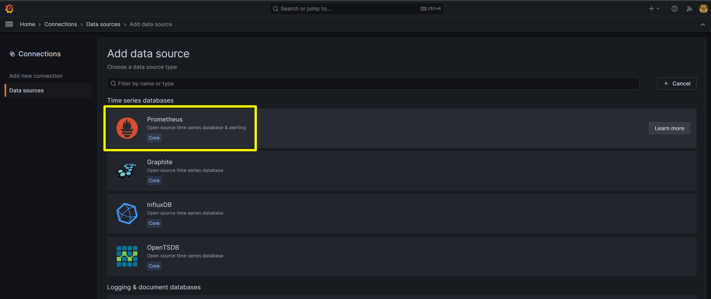
<br/>

Prometheus URL 은 [http://host.docker.internal:9090](http://host.docker.internal:9090) 을 입력해줍니다. 
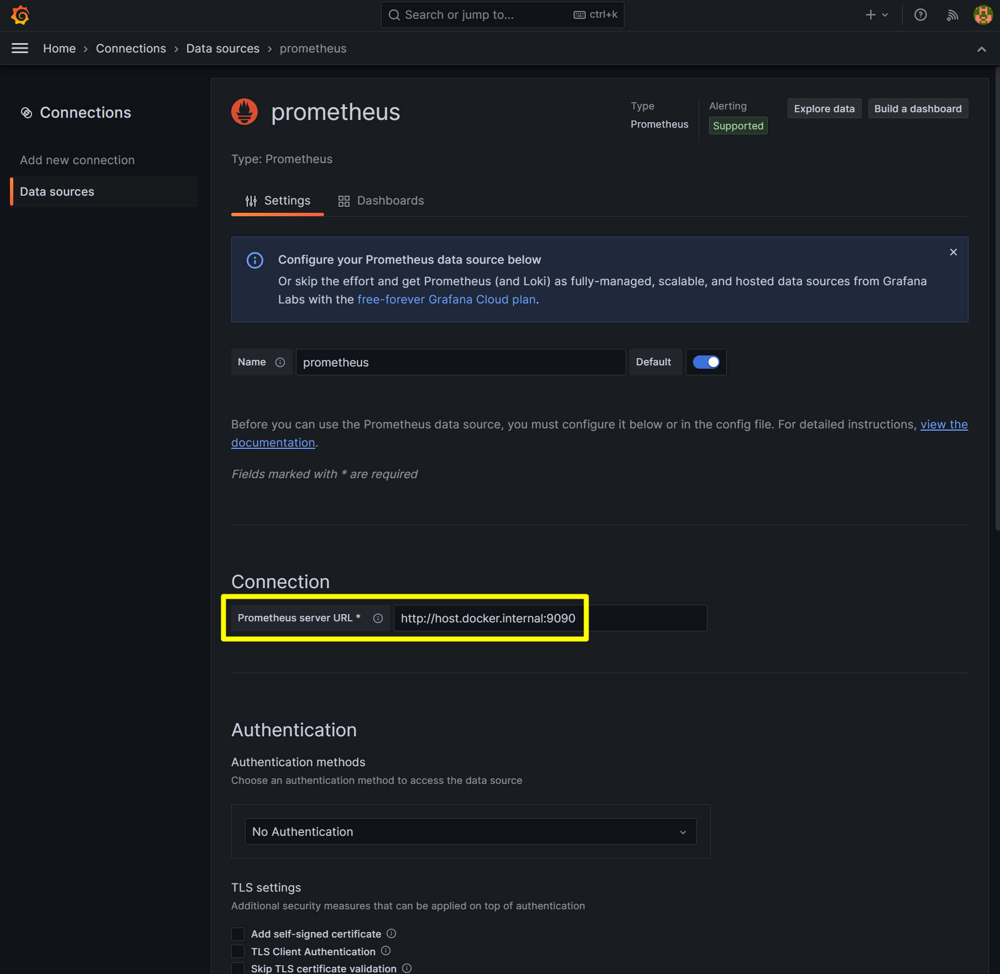
<br/>

스크롤을 아래로 내려서 `Save & test` 버튼을 클릭해서 Prometheus 설정을 마무리합니다.
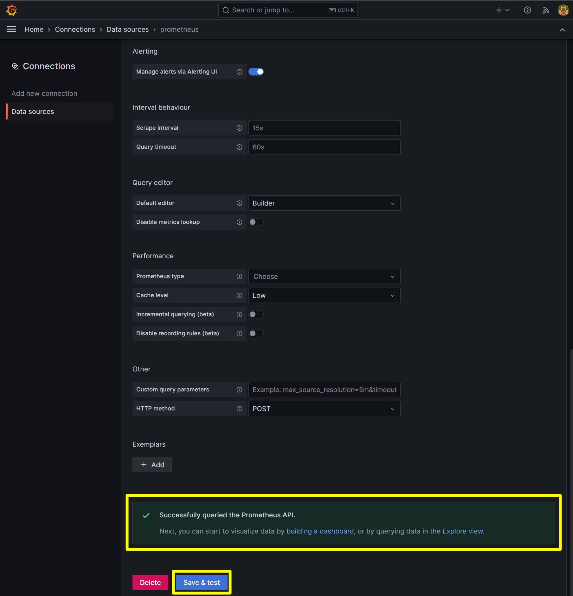
<br/>

다시 홈으로 이동 후  `Dashboard > Create your first dashboard` 를 클릭해서 대시보드 설정 페이지로 이동합니다.<br/>
그리고 `Import a dashboard` 를 클릭합니다.<br/>
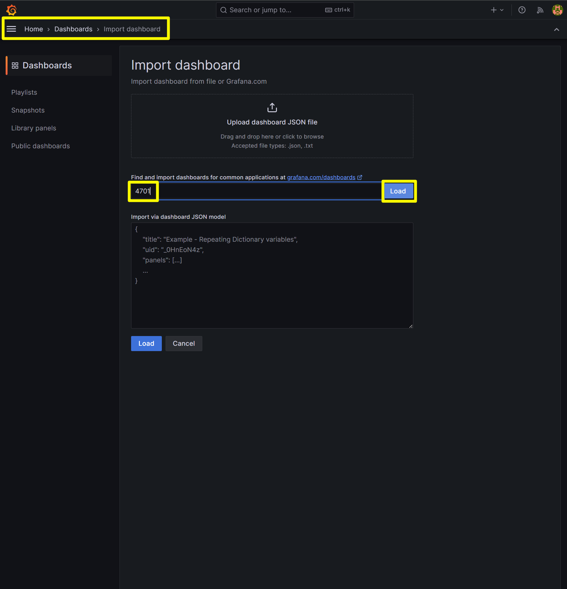
<br/>

`prometheus` 를 선택하고 `Import` 버튼을 클릭합니다.
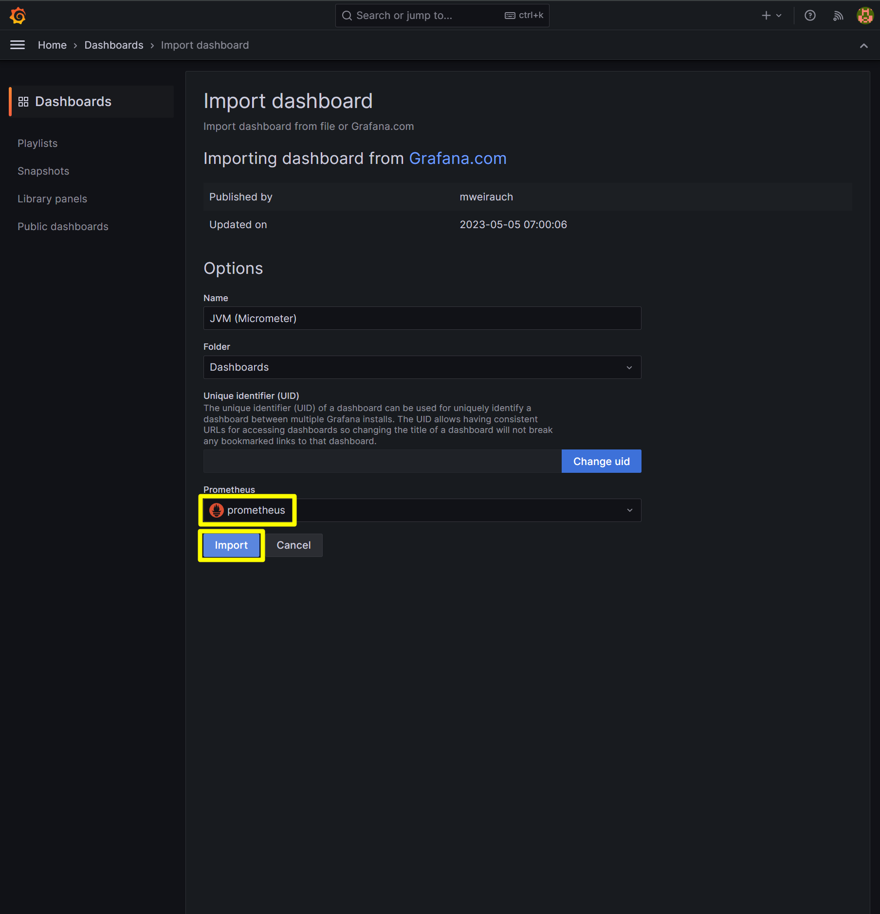
<br/>

설정이 완료되면 아래와 같은 화면이 나타납니다.
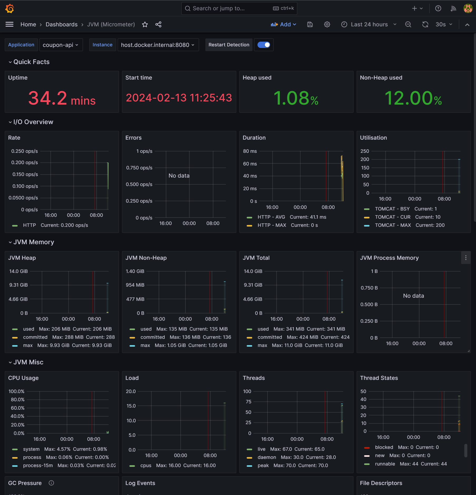